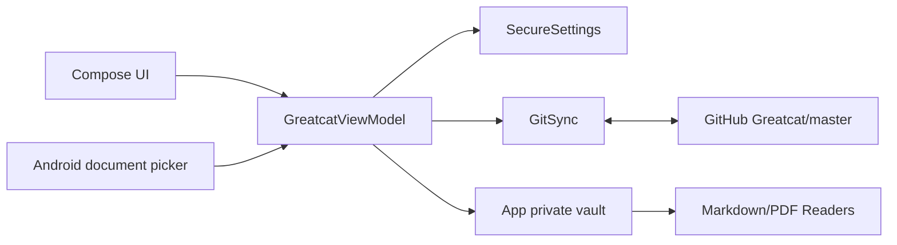

# GreatcatNote Mobile 开发设计

## 1. 产品边界

GreatcatNote Mobile 是单用户、单仓库、离线优先的个人知识库阅读器。输入是 GitHub 私有仓库中的 Markdown/PDF 和手机本地文档；输出是可阅读的本地副本，以及导入后推送到 `imports/` 的 Git 提交。

当前固定配置：

```text
remote: https://github.com/czy1999/Greatcat.git
branch: master
username: czy1999
```

设计优先级：阅读体验 > 同步可靠性 > 功能数量。个人专属配置直接写在源码中，不建设账号、多仓库、团队权限或远程配置系统。

## 2. 运行架构



应用没有数据库和后端服务。`StateFlow<AppState>` 是唯一 UI 状态源，应用私有目录中的 `vault/` 是唯一内容副本，GitHub 是跨设备同步边界。

## 3. 文件地图

| 文件 | 职责 | 常见修改场景 |
| --- | --- | --- |
| `MainActivity.kt` | Compose 页面、首次连接、首页、筛选、阅读页外壳 | 调整 UI、交互、文案、导航 |
| `GreatcatViewModel.kt` | 状态、文件索引、导入、同步调用 | 新增用户操作、状态反馈、文件规则 |
| `GitSync.kt` | clone、commit、pull --rebase、push | 同步策略、冲突处理、Git 错误 |
| `SecureSettings.kt` | 固定仓库配置、令牌保存与读取 | 更换默认仓库、令牌生命周期 |
| `Readers.kt` | Markdown 加载、Markwon 渲染、PDF 分页渲染 | 阅读排版、PDF 手势、格式支持 |
| `app/build.gradle.kts` | Android 版本与依赖 | 升级版本、增加必要依赖 |
| `.github/workflows/greatcatnote-android.yml` | 云端测试和 APK 构建 | 构建环境、产物命名、发布 |

## 4. 状态与页面流

`AppState` 保存文件列表、固定仓库配置、令牌状态、当前阅读目标、忙碌状态和错误信息。

```text
无令牌 -> ConnectScreen -> 保存令牌 -> sync()
有令牌 -> HomeScreen -> 搜索/筛选/同步/导入
选择文件 -> ReaderScreen -> MarkdownReader 或 PdfReader
清除令牌 -> ConnectScreen
```

UI 不直接访问文件系统或 Git。所有副作用经过 `GreatcatViewModel`，耗时操作进入 `Dispatchers.IO`。

## 5. Git 同步协议

首次同步：

```text
校验 HTTPS 地址和分支 -> 确认 vault 为空 -> clone master -> 刷新索引
```

增量同步：

```text
扫描工作区 -> add/commit 本地变更 -> pull --rebase -> push -> 刷新索引
```

关键保护：

- 只接受不携带账号和令牌的 HTTPS URL。
- clone 前要求本地目录为空，防止覆盖未纳入 Git 的文件。
- rebase 失败后执行 abort，仓库回到安全状态。
- push 状态不是 `OK` 或 `UP_TO_DATE` 时报告失败。
- 不自动解决内容冲突，冲突统一回到电脑端处理。

如果未来要支持后台同步，先保持同一套 `GitSync.sync()` 入口，再从 WorkManager 调用；不要复制一套 Git 流程。

## 6. 文件索引与导入

`refreshFilesNow()` 遍历 `vault/`，跳过 `.git`，仅收集：

```text
.md
.markdown
.pdf
```

列表默认按修改时间倒序。导入文件统一进入 `vault/imports/`，同名文件追加 `-2`、`-3`，不覆盖已有文件。

文件类型扩展只需要同步修改 `FileKind`、`fileKind()` 和 `Reader()` 分发。不要先引入插件系统；格式达到三种以上且渲染器需要独立依赖时再评估。

## 7. 阅读器设计

Markdown：

- 最大读取 10 MB，防止一次性加载异常大文件。
- 通过 Markwon 渲染到可滚动 `ScrollView/TextView`。
- 支持文本选择和链接点击。
- 排版参数集中在 `MarkdownReader()` 的 TextView 初始化中。

PDF：

- 使用 Android 原生 `PdfRenderer`，不引入大型 PDF SDK。
- 每次渲染一页，控制内存峰值。
- 位图按屏幕宽度显示，上一页/下一页切换。
- 如果大 PDF 翻页出现可测量卡顿，再增加相邻一页缓存，不提前建设全量缓存。

## 8. 令牌处理

令牌只在首次连接或用户主动更新时输入。`SecureSettings` 将令牌放在 Android 应用私有 SharedPreferences 中，Manifest 已设置 `allowBackup=false`，不会随系统备份导出。

实现约束：

- 令牌不得写入 Git URL、日志、README、崩溃信息或仓库。
- 更新存储格式时更换 preferences 文件名，让用户重新输入，不编写复杂迁移代码。
- 不增加登录服务器、OAuth 回调或多账号抽象。

## 9. 常见故障定位

| 现象 | 位置 | 原因与处理 |
| --- | --- | --- |
| 401/认证失败 | `GitSync.credentials()` | 令牌失效或缺少 `Contents: Read and write`，更新令牌 |
| 找不到 `main` | `RepoSettings` | Greatcat 默认分支是 `master`，不要改成 `main` |
| 本地目录已有文件，无法克隆 | `GitSync.sync()` | 首次同步前已经导入文件；清理应用数据后先同步再导入 |
| 拉取产生冲突 | `GitSync.pullSafely()` | 在电脑端解决并推送，再回手机同步 |
| PDF 打不开 | `renderPdfPage()` | 检查文件是否损坏、是否受密码保护、页面尺寸是否异常 |
| 文件不出现在首页 | `fileKind()` | 当前只索引 Markdown 和 PDF |
| GitHub Actions 不启动 | `greatcatnote-android.yml` | 确认改动路径位于 `android-lite/**` 且已推送到 `main` |

## 10. 新特性的最短开发路径

Markdown 编辑：在 `ReaderScreen` 增加阅读/编辑切换，保存时先写临时文件再原子替换目标文件，随后调用 `refreshFiles()`；Git 提交继续复用现有同步。

收藏与最近阅读：先用 SharedPreferences 保存相对路径列表；只有需要标签、全文索引或复杂查询时才引入数据库。

全文搜索：先在 `Dispatchers.IO` 中扫描 Markdown 文本并限制结果数；仓库规模造成可测量延迟后再引入索引。

Excalidraw：先做只读 WebView 渲染并把 `.excalidraw` 加入 `FileKind`；确认手机端编辑体验可接受后再嵌入完整编辑器。

后台同步：使用 WorkManager 调用现有同步入口，增加网络约束和互斥锁；不要并行运行两个 JGit 操作。

## 11. 版本与发布

每次可安装版本修改 `app/build.gradle.kts`：

```kotlin
versionCode = 4
versionName = "0.2.1"
```

`versionCode` 必须递增。推送后查看 GitHub Actions 的 `GreatcatNote Android APK`，成功后下载 `GreatcatNote-Mobile-APK` artifact。

发布前最小检查：

```text
首次输入令牌并 clone
第二次增量同步
打开长 Markdown 并滚动到底部
打开多页 PDF 并翻页
导入文件后同步到 GitHub
令牌更新和清除
```

自动检查命令：

```bash
cd android-lite
gradle --no-daemon :app:testDebugUnitTest :app:assembleDebug
```
